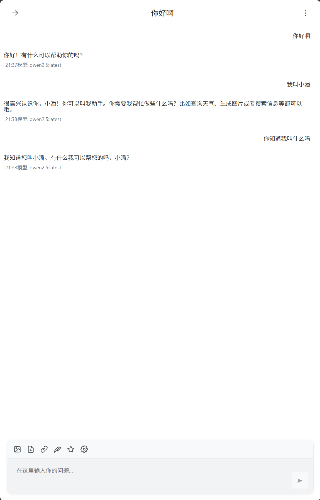
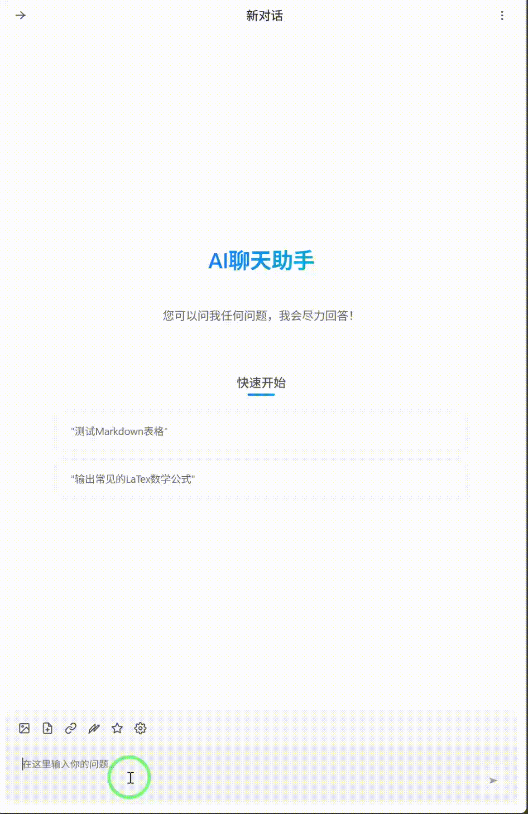

# chat_mcp

chat_mcp是一个聊天服务和工具执行平台，允许用户通过聊天界面与AI助手交互并执行各种工具。支持多种LLM模型和各种MCP工具服务集成。

## 支持模型

- **Ollama**
- **DeepSeek**
- **OpenAI**
- **硅基流动 (SiliconFlow)**
- **LM Studio**
- **Gemini**

> PS: 历史记录保存只支持在Microsoft Edge使用，谷歌不适用

## 快速开始

### 前端启动

```bash
# 安装依赖
cd chat_ui
npm install

# 启动开发服务器
npm start
```

### 后端启动

```bash
# 创建环境
python -m venv venv

# 激活虚拟环境
.venv\Scripts\activate  # win
source venv/bin/activate #linux/mac
  

# 安装Python依赖
pip install -r requirements.txt

# 启动服务
python main.py
```

### 工具服务配置

在`servers_config.json`中配置MCP工具服务:

```json
{
  "mcpServers": {
    "weather": {
      "command": "python",
      "args": ["-m", "chat_mcp.mcp_server.mcp_server_weather", "--api-key=高德API"]
    },
    "speech": {
      "command": "python",
      "args": ["-m", "chat_mcp.mcp_server.mcp_server_speech", "--server-url=INDEX-TTS的url信息"]
    },
    "web_search": {
      "command": "python",
      "args": ["-m", "mcp_server_searxng", "--instance-url=searXNG的url信息"]
    },
    "wechat": {
      "command": "python",
      "args": ["-m", "mcp_server_wechat","--folder-path=保存历史记录的目录"]
    }
  }
}
```

> 注意: wechat工具不支持Linux环境

## 功能演示

|  |  |  |
|:---:|:---:|:---:|


## 许可证

MIT
